# Environment Setup

The following content uses **Windows 10** operating system as an example to introduce the download, installation, and configuration of required software.


## Runtime Environment

*   JDK 11 + or OpenJDK 11 +
*   Redis 4.x/6.x +
*   MariaDB 10+, MySql 5.7+, Oracle, SqlServer, DM, etc.
*   Nacos 2.0.3 +

## Development Tools
*   IntelliJ IDEA `Open source project authors can apply for free license certificates`
*   Visual Studio Code
*   Node 16.x/18.x/19.x +
*   Maven 3.x +
*   Git

## JDK Installation and Configuration

#### Download and Install OpenJDK 11

* Windows/x64 [http://jdk.java.net/java-se-ri/11](http://jdk.java.net/java-se-ri/11)

#### System Environment Variable Configuration

* Win Start - Right-click -> System -> About -> Advanced System Settings

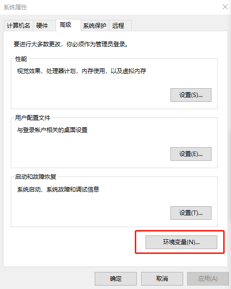

* Configure `JAVA_HOME` `C:\jdk-11 directory`


* Configure `Path` `C:\jdk-11\bin directory`

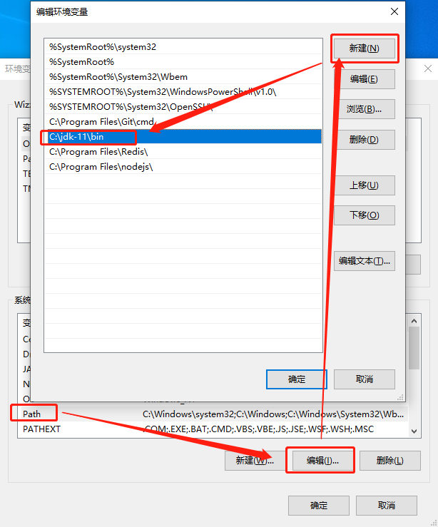

* `Win + R hotkey` or Win Start - Right-click -> Run `cmd` -> `java -version` to check if the configuration is correct


## Redis Installation and Configuration

#### Download and Install Redis `5.0.10`

* Windows/x64 msi [https://github.com/tporadowski/redis/releases](https://github.com/tporadowski/redis/releases)

* Add the redis folder to the environment variables


* Run `cmd` -> `redis-cli` to check if Redis is installed correctly

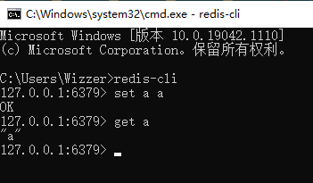

## MariaDB Installation and Configuration

#### Download and Install MariaDB `10.6.4`

* Windows/x86_64 msi [https://mariadb.org/download/](https://mariadb.org/download/)

* Set the password to `root` **The password can be simple in the development environment, but this password is prohibited in the production environment** 

* Use `UTF8` character set by default

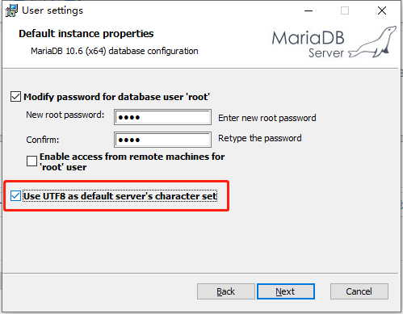


## Nacos Installation and Configuration

#### Download Nacos `2.0.3`

* nacos-server-2.0.3.zip [https://github.com/alibaba/nacos/releases](https://github.com/alibaba/nacos/releases)

#### Install and Configure Nacos

* Extract the nacos folder from the zip file to `D:\server\nacos`

* Open the `D:\server\nacos\bin\startup.cmd` file with Notepad, change the running mode to `standalone` and save the file

```text
set MODE="standalone"
```

* Open the `D:\server\nacos\conf\application.properties` file with Notepad, modify the data source and save the file

```text
### If use MySQL as datasource:
spring.datasource.platform=mysql

### Count of DB:
db.num=1

### Connect URL of DB:
db.url.0=jdbc:mysql://127.0.0.1:3306/nacos?characterEncoding=utf8&connectTimeout=1000&socketTimeout=3000&autoReconnect=true&useUnicode=true&useSSL=false&serverTimezone=UTC
db.user.0=root
db.password.0=root
```

* Create a `nacos` database in the database and import the data, using the HeidiSQL client tool that comes with MariaDB installation as an example


* Select the server-consistent `utf8mb3_general_ci` character set

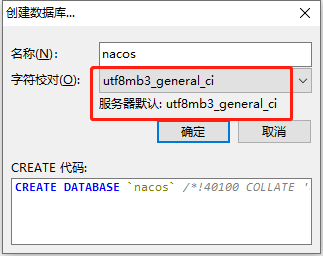

* Select the `nacos` database, HeidiSQL menu File -> Run SQL file -> Open and run the `D:\server\nacos\conf\nacos-mysql.sql` file

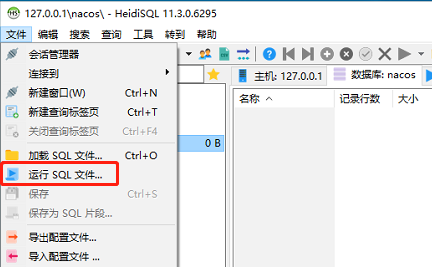

* After execution, right-click the `nacos` database -> Refresh, and you can view the related tables

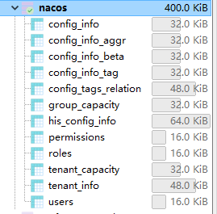

#### Run Nacos

* Double-click the `D:\server\nacos\bin\startup.cmd` file

* After startup is complete, open [http://127.0.0.1:8848/nacos](http://127.0.0.1:8848/nacos) in your browser

* Enter username `nacos` and password `nacos` to access the management backend

## Maven Installation and Configuration

#### Download Maven `3.8.1`

* apache-maven-3.8.1-bin.zip [https://maven.apache.org/download.cgi](https://maven.apache.org/download.cgi)

* Extract the maven folder from the zip file to `D:\server\apache-maven-3.8.1`

* Configure system environment variables


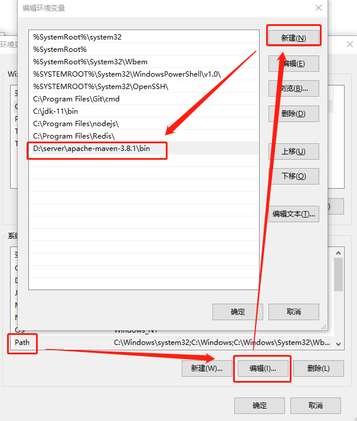

* Run `cmd` -> `mvn -version` to check if Maven is installed correctly

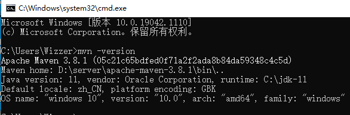

#### Maven Repository Configuration

* If you have configured a mirror repository, such as Alibaba's mirror repository, you should **not** configure `mirrorOf` as * (asterisk represents all, whether release or snapshots, which will cause all third-party snapshot repository settings to be ineffective) in your `settings.xml`
* The correct configuration is as follows:
```xml
<mirror>
    <id>nexus-aliyun</id>
    <mirrorOf>central</mirrorOf>
    <n>Nexus aliyun</n>
    <url>http://maven.aliyun.com/nexus/content/groups/public</url>
</mirror>
```

## Git Installation and Configuration

#### Download Git

* 64-bit Git for Windows Setup [https://git-scm.com/](https://git-scm.com/)

#### Create Repository

Using [https://gitee.com](https://gitee.com) as an example to demonstrate the process of creating a repository, configuring SSH keys, creating a repository, and submitting documents.

* Select `New Repository` in the upper right corner of the homepage

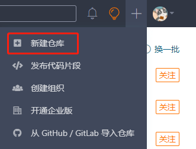

* Select `Development Language`, `.gitignore configuration file to ignore submissions`, `Open Source License`, set `Readme file` to create

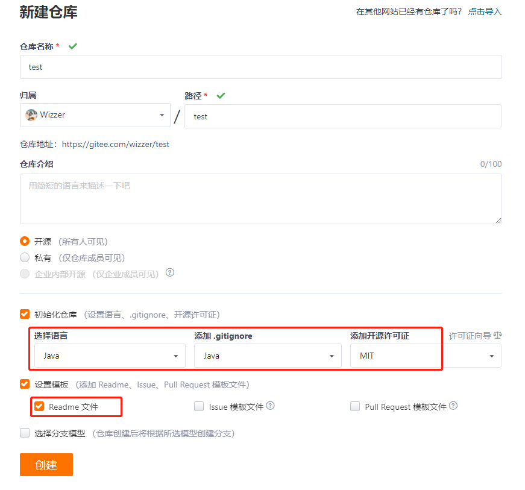

* Creation complete

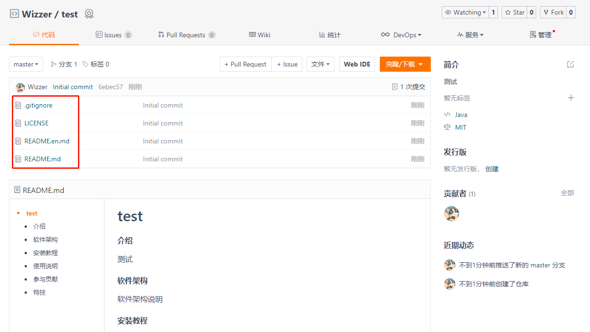

* Click `Settings` in the upper right corner, select `SSH Public Key`, generate and configure the SSH public key, and then you can submit files on your computer


#### Generate SSH Public Key

* Documentation [https://gitee.com/help/articles/4181](https://gitee.com/help/articles/4181)

* Open the `Git CMD` command line and enter the following (remember to change the email address to your own):

```text
ssh-keygen -t rsa -C "wizzer@qq.com"
```

* For the 2nd line asking whether to rename, press Enter directly; for the 3rd line asking whether to set a password, press Enter directly; for the 4th line asking to repeat the password, press Enter directly. This will create the `id_rsa` private key file and `id_rsa.pub` public key file in `C:\Users\ComputerName\.ssh`


* Open the `id_rsa.pub` public key file with Notepad, copy the entire contents of the file and paste it into the `SSH Public Key` in the user center of repositories like `gitee` or `github`

* Right-click on your computer desktop, create a new text document, change the file name to `config` (note: no extension), paste the following content, save and copy to the `C:\Users\ComputerName\.ssh` directory

```text
Host gitee.com
    HostName gitee.com
    User wizzer@qq.com
    PreferredAuthentications publickey
    IdentityFile C:\Users\Wizzer\.ssh\id_rsa
```

* Remember to change the email address to your own


#### Git Commands

* Open the command line, switch to drive D, use `git clone` to clone project files

```text
C:\>D:
D:\>mkdir java
D:\>cd java
D:\java>git clone git@gitee.com:wizzer/test.git
```

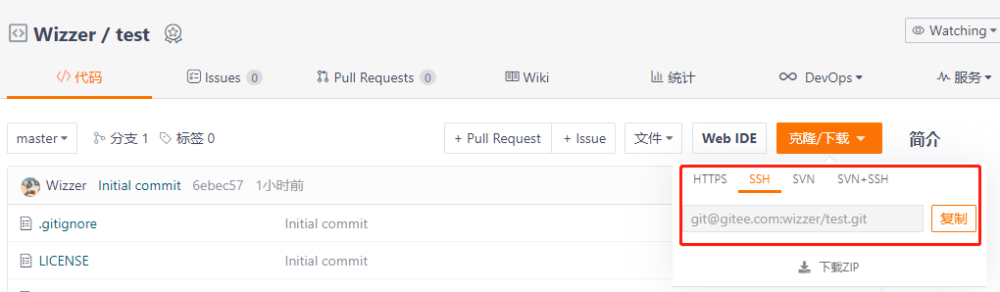

* Common Git Commands
```text
git pull                    # Download updated files
git add 1.txt               # Add files to be committed
git commit -am "add: 1.txt" # Comment explaining the commit content
git push                    # Submit files
git status                  # Check status
```

## Node.js Installation and Configuration

#### Download Node.js

* Index of /dist [https://nodejs.org/dist/](https://nodejs.org/dist/)

* Find `v19.2.0`, download the `node-v19.2.0-win-x64.zip` file, and install it

* The frontend Vue3 project `wk-vue3-admin` is compatible with Node.js `v16.x` `v18.x` `v19.x` versions, please test higher versions yourself 