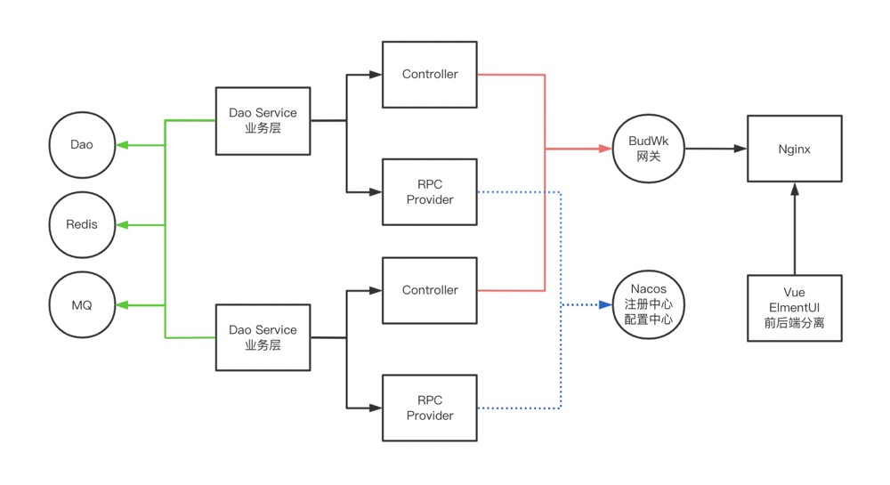

# Project Introduction
[](https://github.com/budwk/budwk/blob/master/LICENSE)
[](https://github.com/budwk/budwk/releases)
[](https://budwk.com/donation)


BudWk, originally named NutzWk, is an open-source Java enterprise-level web development framework based on the domestic framework NutzBoot. It has nearly a decade of open-source history, has accumulated a large number of enterprise and individual users, and has undergone several iterations from V1 to V8.

V8, building on the API gateway, component library, authentication center, control center, and other features of V7, further upgrades and transforms the front-end and back-end functionality, enhances user experience, while greatly reducing development workload, improving development efficiency, and providing great convenience for product upgrades and iterations.

The framework provides both "microservice single application" and "microservice distributed" versions to choose from. The backend includes the most commonly used functions such as permission system, system parameters, data dictionary, internal messaging, scheduled tasks, CMS, WeChat, etc., making it easy to get started, convenient for development, and flexible for extension, particularly suitable for various large, medium, and small customized project requirements.

* **Long History**: Open source for nearly ten years with multiple iterations from V1 to V8, keeping up with technological developments and enterprise application needs, supporting various application scenarios such as e-government, e-commerce, IoT, vehicle networking, etc.
* **Open Source and Free**: V8 front-end and back-end code is completely open source and free, although donations are welcome as they are the driving force for the framework's continuous development (Note: Paid custom development and enterprise development training are accepted).
* **Easy to Learn**: Although V4 and V6 took some detours, the author has always insisted on "maximizing the productivity of web developers within capabilities". The V8 framework has a simple architecture, comprehensive functionality, low learning cost, and can be mastered through self-learning or simple training.
* **Rich Versions**: V8 backend provides single application and distributed versions to choose from, both versions have identical functionality, support war package deployment and jar package deployment, and the distributed version is based on Nacos and Dubbo; V8 frontend provides Vue2 + ElementUI and Vue3 + Element-Plus + TypeScript versions to choose from.

## Preface
This document will guide you step by step to use this framework to build a backend management system and do secondary development based on it.

BudWk Java backend is a microservice distributed framework developed based on NutzBoot. NutzBoot is a boot-based encapsulation on the foundation of Nutz. If you need to understand the underlying operating mechanism in depth, you can **read the Nutz basic knowledge in detail**:stuck_out_tongue:

* [http://nutzam.com/core/nutz_preface.html](http://nutzam.com/core/nutz_preface.html)

## Demo Address

* `Admin Dashboard` [https://demo.budwk.com](https://demo.budwk.com)
* `API Documentation [Single Application Version]` [https://demo.budwk.com/api/openapi/](https://demo.budwk.com/api/openapi/#/load/openapi.json)
* `API Documentation [Distributed Version]` `/api/` + `module name` + `/openapi/`

## Technical Architecture

BudWk-V8/V7 adopts the currently popular gateway + API + front-end and back-end separation architecture. Backend developers only need to develop APIs, and frontend developers only need to develop page effects according to the API documentation. If your project team has `Java > 1 and Vue > 1`, then development efficiency will be significantly improved. If one person is full-stack, it will be more challenging...



## Technology Stack

### Backend Technology
Technology | Name | Official Website
----|------|----
Nutz | JavaEE Application Framework  | [https://nutzam.com](https://nutzam.com)
NutzBoot | Microservice Framework  | [https://github.com/nutzam/nutzboot](https://github.com/nutzam/nutzboot)
SaToken | Authorization Framework  | [https://sa-token.dev33.cn](http://sa-token.dev33.cn)
Druid | Database Connection Pool  | [https://github.com/alibaba/druid](https://github.com/alibaba/druid)
Nacos | Configuration and Registration Center  | [https://nacos.io](https://nacos.io)
Dubbo | Distributed Service Framework  | [https://dubbo.apache.org](https://dubbo.apache.org)
Redis | Distributed Cache Database  | [https://redis.io](https://redis.io)
Quartz | Job Scheduling Framework  | [https://www.quartz-scheduler.org](https://www.quartz-scheduler.org)
IdGenerator | Snowflake Primary Key Generation  | [https://github.com/yitter/IdGenerator](https://github.com/yitter/IdGenerator)
Hutool | Utility Collection  | [https://hutool.cn](https://hutool.cn)

### Vue3 Frontend Technology (wk-vue3-admin)
Technology | Name | Official Website
----|------|----
Vue3 | MVVM Framework | [https://vuejs.org](https://vuejs.org)
Vite | Application Framework | [https://vitejs.dev](https://vitejs.dev)
Element-Plus | UI Framework Based on Vue3 | [https://element-plus.gitee.io/zh-CN](https://element-plus.gitee.io/zh-CN/)
Font-awesome | Font Icons  | [https://fontawesome.com](https://fontawesome.com)

## Directory Structure

```lua
budwk                               -- Root Directory
│  ├─wk-starter                     -- Component Center
│  │  ├─wk-starter-common           -- Common Class Component
│  │  ├─wk-starter-apiauth          -- API Signature Verification Component
│  │  ├─wk-starter-database         -- Database Component
│  │  ├─wk-starter-config           -- Configuration Component
│  │  ├─wk-starter-dependencies     -- Jar Dependencies and Version Numbers
│  │  ├─wk-starter-dubbo            -- Dubbo Component
│  │  ├─wk-starter-email            -- Email Component
│  │  ├─wk-starter-excel            -- Excel Import/Export Component
│  │  ├─wk-starter-gateway          -- Gateway Component
│  │  ├─wk-starter-job              -- Simple Scheduled Task Component
│  │  ├─wk-starter-log              -- Log and SLog Component
│  │  ├─wk-starter-openapi          -- API Documentation Generation Component
│  │  ├─wk-starter-security         -- Permission Verification Component
│  │  ├─wk-starter-sms              -- SMS Sending Component
│  │  ├─wk-starter-storage          -- File Storage Component
│  │  ├─wk-starter-web              -- WEB Interception Cross-domain Form Validation Component
│  ├─wk-gateway                     -- Gateway Center
│  │  ├─websocket                   -- WebSocket Support
│  ├─wk-platform                    -- Control Center
│  │  ├─wk-platform-common          -- Common Classes for Other Modules
│  │  ├─wk-platform-server          -- Service Class Providing API and RPC Services
│  ├─wk-ucenter                     -- Authentication Center
│  ├─wk-cms                         -- CMS Management
│  │  ├─wk-cms-common               -- Common Classes for Other Modules
│  │  ├─wk-cms-server               -- Service Class Providing API and RPC Services
│  ├─wk-wechat                      -- WeChat Management
│  │  ├─wk-wechat-common            -- Common Classes for Other Modules
│  │  ├─wk-wechat-server            -- Service Class Providing API and RPC Services
│  ├─wk-vue-admin                   -- Vue2 Frontend Code
│  ├─wk-vue3-admin                  -- Vue3 Frontend Code
│  ├─wk-mini                        -- Mini Single Application Version (One jar startup without nacos)
```

## Backend Features

### Control Center

- System Management
  - Organization Management `Add, delete, modify, query, and sort organization data`  
  - Position Management `Add, delete, modify, query, and sort position data`
  - User Management `Add, delete, modify, query user data, reset password, enable/disable, export user data`
  - Role Management `Role group and role management, assign menus and permissions to roles, maintain user-role relationships`
  - Application Management `Add, delete, modify, query, enable/disable microservice module applications`
  - Menu Management `Add, delete, modify, query application menus, maintain permissions, menu sorting, etc.`
  - Log Management `Query functions for login logs and business logs`
  - Task Management `Add, delete, modify, query, enable/disable scheduled tasks`
  - Message Management `Send internal messages (including messages triggered by programs), view historical messages`
- System Configuration
  - System Parameters `Configuration management for public parameters and application parameters`
  - Data Dictionary `Management of public data dictionaries and application data dictionaries`
  - Key Management `Key management reserved for APIs (API Sign -> API Token -> USER Token)`
  - Account Security `Password rules, password retry count, password expiration configuration, verification code settings`
- Operation Management
  - Service List `View the status of Dubbo services or gateway services registered on Nacos`
  - Server Monitoring `View server CPU/memory/network/Redis/JVM usage (currently only supports single-machine deployment)`

### UCenter

- User Login
  - Login via username + password
  - Login via mobile phone number + SMS verification code
  - SSO single sign-on
  - RSA frontend password encryption
  - Third-party QQ, WeChat, Alipay login
- User Registration
  - Registration via mobile phone number + SMS verification code
- Password Recovery
  - Recovery via mobile phone number + SMS verification code
  - Recovery via Email + verification code  
    
### CMS

- Site Management `Basic information management for multiple sites`
- Category Management `Category management under sites`
- Article Management `Add, delete, modify, query articles under site categories`
- Friendly Links
  - Link Management 
  - Banner Management
    
### WeChat

- WeChat Members `View member information, manual synchronization of member information required for the first time`
- Message Management
  - Member Messages `View plain text, image, video, and other message content sent by members, and reply`
  - Mass Messages `Edit graphic materials, send mass messages to selected members`
- Automatic Reply
  - Text Content `Manage plain text content`
  - Image Content `Manage image content`
  - Graphic Content `Manage graphic content`
  - Event Configuration `Follow event - triggered when users follow the official account to send plain text, images, graphics; Keyword event - triggered when user message content contains keywords or keywords bound to the official account menu`
- Template Messages
  - Template Number `Add template numbers from the WeChat official account backend`
  - Template List `Synchronize template content through template numbers`
  - Sending Records `View sending records after sending template messages through the program`
- WeChat Configuration
  - Official Account Configuration `WeChat official account configuration, platform can obtain user information after configuring URL in WeChat backend`
  - Menu Configuration `WeChat official account menu configuration, push menus to WeChat`
  - Mini Program Configuration `WeChat mini program information configuration`
  - WeChat Payment `WeChat payment merchant information configuration, V2 payment example, V3 payment example`

## Feedback

* `Q&A Community` [https://nutz.cn](https://nutz.cn)
* `Gitee` [https://gitee.com/budwk/budwk/issues](https://gitee.com/budwk/budwk/issues)
* `Github` [https://github.com/budwk/budwk/issues](https://github.com/budwk/budwk/issues)
* `QQ Group 1` 68428921(Full)
* `QQ Group 2` 24457628
* `QQ/WeChat` wizzer **Custom development, enterprise training**👌 