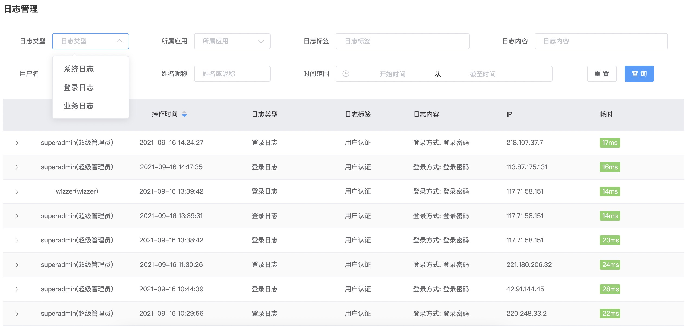

# Logging System

## Log Generation

* Microservice modules such as `wk-platform-server` incorporate the `wk-starter-log` component and configure it

* Use the annotation `@SLog(tag = "Data Dictionary")` on the controller class to define the log tag

* Use the annotation `@SLog(value = "")` on the controller method to define the log content

```java
@IocBean
@At("/sys/dict")
@SLog(tag = "Data Dictionary")
@ApiDefinition(tag = "Data Dictionary")
@Slf4j
public class SysDictController {

      @At
      @Ok("json")
      @POST
      @SaCheckPermission("sys.config.dict.update")
      // value can use expressions to get parameters
      @SLog(value = "Modify dictionary item:${dict.name}")
      public Result<?> update(@Param("..") Sys_dict dict, HttpServletRequest req) {
          dict.setUpdatedBy(SecurityUtil.getUserId());
          sysDictService.updateIgnoreNull(dict);
          sysDictService.cacheClear();
          return Result.success();
      }
}
```

* Some information can only be obtained after execution. This can be set through expressions or using the built-in `_slog_msg` attribute name

```java
    // Method 1
    @At("/disabled")
    @Ok("json")
    @POST
    @SaCheckPermission("sys.config.dict.update")
    @SLog(value = "Enable/Disable:${id}-")
    public Result<?> changeDisabled(@Param("id") String id, @Param("disabled") boolean disabled, HttpServletRequest req) {
        int res = sysDictService.update(Chain.make("disabled", disabled), Cnd.where("id", "=", id));
        if (res > 0) {
            if (disabled) {
                // _slog_msg is a built-in attribute name, automatically appended to value
                req.setAttribute("_slog_msg", "Disabled");
            } else {
                req.setAttribute("_slog_msg", "Enabled");
            }
            return Result.success();
        }
        return Result.error();
    }

    // Method 2
    @At("/disabled")
    @Ok("json")
    @POST
    @SaCheckPermission("sys.config.dict.update")
    @SLog(value = "Enable/Disable:${id}-${req.getAttribute('_result')}")
    public Result<?> changeDisabled(@Param("id") String id, @Param("disabled") boolean disabled, HttpServletRequest req) {
        int res = sysDictService.update(Chain.make("disabled", disabled), Cnd.where("id", "=", id));
        if (res > 0) {
            if (disabled) {
                req.setAttribute("_result", "Disabled");
            } else {
                req.setAttribute("_result", "Enabled");
            }
            return Result.success();
        }
        return Result.error();
    }
```

## Log Query

* The system has three default log types in the `LogType` enumeration. You can extend these according to your business needs

* The system uses database storage by default (MongoDB is optional). Database storage automatically partitions tables by month and supports cross-month queries



## Trace Tracking

* It has log trace tracking functionality, meaning that in program runtime logs, request sources, responses, and Dubbo call chains can be recorded and tracked, facilitating problem analysis in distributed systems

* Using ELK, aggregated logs can query the entire trace chain through traceId 