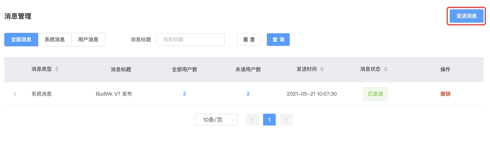

# Internal Messages

* You can manually send internal messages through the `Message Management` page



* You can also call methods in business code to send messages

```java
    @Inject
    @Reference(check = false)
    private ISysMsgProvider sysMsgProvider;
```

```java

public interface ISysMsgProvider {
    /**
     * Send notification messages to a specific token (not stored in database, only notified via WebSocket)
     *
     * @param userId User ID
     * @param token  Token value
     * @param msg    Message content
     */
    void wsSendMsg(String userId, String token, String msg);

    /**
     * Send notification messages (not stored in database, only notified via WebSocket)
     *
     * @param userId User ID
     * @param msg    Message content
     */
    void wsSendMsg(String userId, String msg);

    /**
     * Send notification messages (not stored in database, only notified via WebSocket)
     *
     * @param userId User ID
     * @param msg    Message content
     */
    void wsSendMsg(List<String> userId, String msg);

    /**
     * Check user login
     *
     * @param userId
     * @param token
     */
    void wsCheckLogin(String userId, String token);

    /**
     * Send message
     *
     * @param userId     User ID
     * @param type       Message type
     * @param title      Message title
     * @param url        URL
     * @param note       Message content
     * @param sendUserId Sender
     */
    void sendMsg(String userId, SysMsgType type, String title, String url, String note, String sendUserId);

    /**
     * Send message
     *
     * @param userId     User ID array
     * @param type       Message type
     * @param title      Message title
     * @param url        URL
     * @param note       Message content
     * @param sendUserId Sender
     */
    void sendMsg(String[] userId, SysMsgType type, String title, String url, String note, String sendUserId);

    /**
     * Get message notifications after user logs into the system
     *
     * @param userId User ID
     * @param notify Whether to pop up notification box
     */
    void getMsg(String userId, boolean notify);
} 