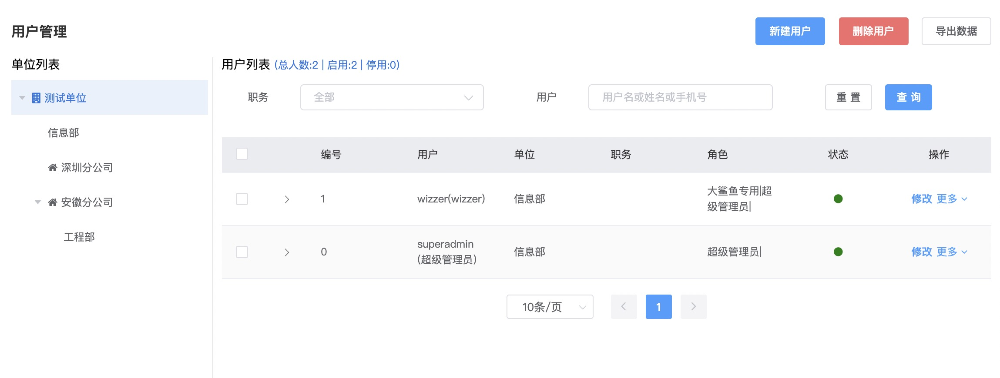
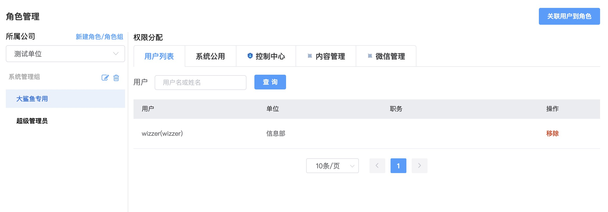
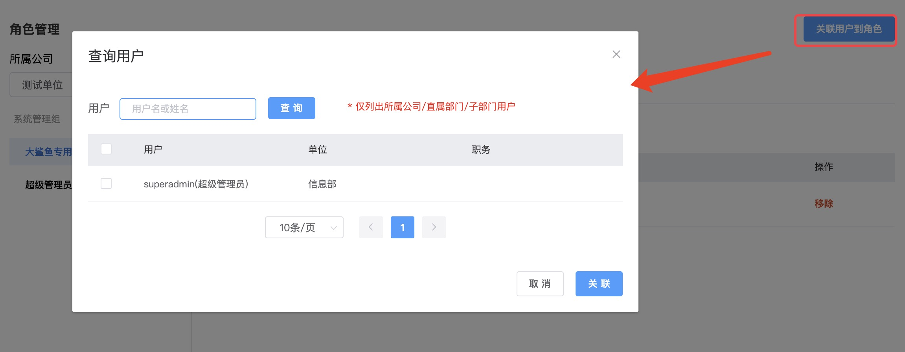

# Permission System

* This system adopts the typical `RBAC0 model`, which implements permission control through `User-Role-Permission (Menu Permission + Button Permission)`

## Application Management

* The `API Gateway` will route proxy through the application's `request path`. You can divide the system into different applications according to business characteristics, and configure menus and permissions for each application separately

* `System Common [COMMON]` is for system common content, such as configuring common system parameters, common menus for all applications such as internal messages, modifying personal information, changing personal passwords, etc.

* `Control Center [PLATFORM]` is the system's basic application, providing business implementation of the user permission system, management functions for basic business tables, etc.

* `User Center [UCENTER]` is a built-in application that does not need to be created, mainly providing functions such as user login, verification code, third-party login, etc.


## Menu Management

* First-level menus are function categories, second-level menus are specific functions that need to configure URL request paths, and third-level menus are internal page jump paths (if interaction can be implemented with pop-up boxes, try to avoid jumps)

* The `Display` attribute determines whether the configured menu is displayed in the frontend navigation bar

* Menus need to set a globally unique `Permission Identifier`, and menu sub-permissions also need to set a `Permission Identifier`. In the framework, the permissions owned by a `role` are a collection of `Permission Identifiers`


## Organization Management

* The top-level organization is `Headquarters (or Company)`. Under `Headquarters`, you can create `Branch Companies` or `Departments`. `Branch Companies` can only create `Departments`

* During business development, business tables can store both `unitId` and `unitPath` fields. `unitPath` is the `path` field of the tree-structured organization table, with a maximum length of 100, 4 digits per level, such as a string like `00010001`.
  You can quickly query parent-child relationship data through the `like` query statement


## User Management

* `Users` must belong to a certain `Organization`. When creating a new user, you need to select the organization on the left first



* It is now quite common for mobile phone numbers to be the same as usernames. The system defaults to using the last six digits of the mobile phone number as the login password

* In V7/V8, you can set whether users need to forcibly change the default password when logging in through `Account Security Settings`

* Multiple roles can be assigned to a user, such as system common roles, company or branch company roles


## Role Management

* Select `Headquarters or Company` on the left, select a `Role`, and on the right, you can view the `User List` and `Menus and Permissions` for each application

* `System Common Group`-`Common Role` is a system built-in role. The `Menus and Permissions` assigned to this role are owned by all users by default



* Under the `Headquarters or Company` organization, you can create `Role Groups` and `Roles`, and set globally unique `Role Codes`


* `Associate Users to Role` establishes a binding relationship between `Users` and `Roles`. The relationship between `Users` and `Roles` is many-to-many



* Switch to the application tab to assign `Menus and Permissions` to `Roles` respectively


## Login Process

* After a user enters their username and password on the login page, [Distributed Version] `wk-ucenter` will first verify the verification code. After verification passes, it will RPC call the `wk-platform` interface to determine if the username and password are correct

* If the username and password verification is correct, it returns the `Role Code` and `Permission Identifier` collection data. `sa-token` caches the `Role Code` and `Permission Identifier` and generates a `token`
  
* `wk-ucenter` returns `User Information`, `Menus and Permissions`, `token`, and other information to the frontend

## Permission Control

* The backend mainly implements permission interception in the controller layer through annotations provided by `sa-token`: `SaCheckPermission Permission Identifier`, `SaCheckRole Role Code`, `SaCheckLogin Whether Logged In`
  
* In addition to annotations, you can also judge permissions in the code through utility class methods such as `StpUtil.checkPermission("")`

* As an additional note, why choose `sa-token` and abandon `shiro`? Because those who have suffered with `shiro` for a long time understand...

```java
    @At
    @Ok("json")
    @GET
    @SaCheckPermission("sys.manage.menu")
    public Result<?> data() {
        NutMap map = NutMap.NEW();
        map.addv("apps", sysAppService.listAll());
        return Result.data(map);
    }
```

* The frontend mainly controls whether page components are displayed through the encapsulated `v-permission` directive


vue3
```vue
<el-button
          v-permission="['sys.manage.menu.create']"
          size="small"
          type="primary"
          @click="openAdd"
        >
        Create Menu
</el-button>
``` 