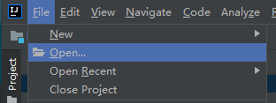

# Backend Development Setup

## Single Application Version

* Use `IDEA -> File -> Open` to open `wk-mini`, such as `D://java/budwk/wk-mini`



* If the Maven project is not automatically loaded, you can right-click on the `pom.xml` file and select `Add as Maven Project`

## Distributed Version

### Open Project in IDEA

* Use `IDEA -> File -> Open` to open the project root directory, such as `D://java/budwk`


* Expand `wk-gateway / wk-platform / wk-ucenter / wk-cms` respectively
  
* Right-click on the `pom.xml` file and select `Add as Maven Project` 

* Be patient, IDEA will automatically download dependency JAR packages through Maven and build the project structure (you can check the progress in the bottom right corner of IDEA)


### Project Configuration Files

* If your Nacos and MariaDB are not running on the local machine, please search for `127.0.0.1` through IDEA and modify `application.yaml` to the actual IP address and port number

* Database-related address configuration

```yaml
jdbc:
  url: jdbc:mysql://127.0.0.1:3306/budwk_v8?useUnicode=true&characterEncoding=utf8&useSSL=false
  username: root
  password: root
```
* Nacos service discovery, configuration center, Dubbo service registration related address configuration (example)


```yaml
nacos:
  discovery:
    server-addr: 127.0.0.1:8848
    namespace: dev
    naming:
      service-name: budwk.wechat
      meta-data: "{'version':'v1'}"
  config:
    server-addr: 127.0.0.1:8848
    namespace: dev
    data-id: wk-wechat
    data-type: yaml
dubbo:
  registry:
    address: nacos://127.0.0.1:8848?namespace=dev
  protocol:
    name: dubbo
    threads: 200
    #random port
    port: 0
    #QOS service disabled by default
  application:
    qos:
      enable: false
``` 