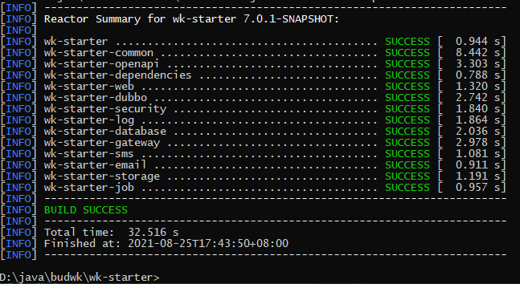

# Dependency Installation

## Maven Dependency Installation

### Single Application Version `wk-mini`


* Open the command line, switch to the `wk-starter` directory and execute the `mvn install` command

* If your Maven cannot download normally, you can execute the `mvn install -U` command

```text

D:\java\budwk>cd wk-starter

D:\java\budwk\wk-starter>mvn install
```

### Distributed Version


* Open the command line, switch to the `wk-starter` directory and execute the `mvn install` command

* If your Maven cannot download normally, you can execute the `mvn install -U` command

```text

D:\java\budwk>cd wk-starter

D:\java\budwk\wk-starter>mvn install
```

* Switch to the `wk-platform` directory and execute the `mvn install` command

```text
D:\java\budwk\wk-platform>mvn install
```



## Node Dependency Installation

* Open the command line, switch to the `wk-vue3-admin` directory and execute the `npm i` or `pnpm i` command

```text
D:\java\budwk>cd wk-vue3-admin

D:\java\budwk\wk-vue3-admin>pnpm i
``` 