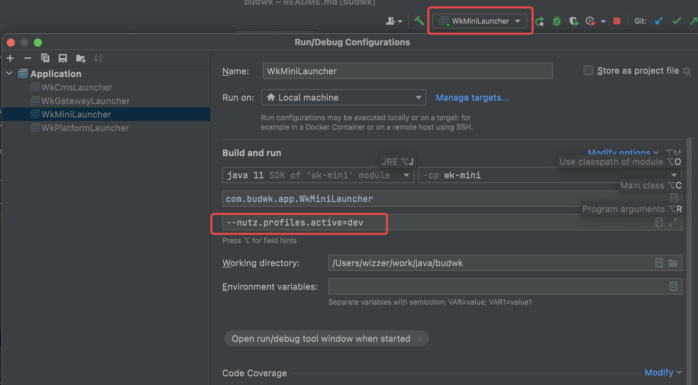

# Project Startup

## Single Application Version

* Find `WkMiniLauncher.java` and right-click to run


* Edit the startup project, you can specify loading the `application-dev.yaml` configuration file through the command line parameter `--nutz.profiles.active=dev`



## Distributed Version

* Startup sequence: `wk-platform` -> `wk-ucenter` -> `wk-gateway` -> `other modules`

* Find the `***Launcher` class under each microservice module, right-click -> Run


  
* After startup is complete, accessing [http://127.0.0.1:9900](http://127.0.0.1:9900) in your browser and seeing a 404 error is correct


## Vue3 Frontend Startup


* Open the command line, switch to the `wk-vue3-admin` directory and execute the `pnpm run dev` command

```text
D:\java\budwk\wk-vue3-admin>pnpm run dev
```


* After startup is complete, access [http://127.0.0.1:1818](http://127.0.0.1:1818) in your browser to log in to the management backend

 