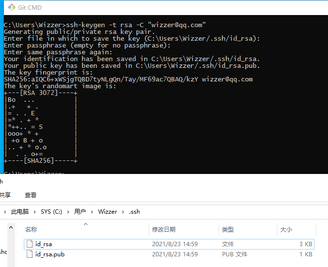

# 环境搭建

以下内容，以 **Windows 10** 操作系统为例，介绍运行所需软件的下载、安装、配置等。


## 运行环境

*   JDK 11 + 或 OpenJDK 11 +
*   Redis 4.0.8 +
*   MariaDB 10+、MySql 5.7+、Oracle、SqlServer、达梦等
*   Nacos 2.0.3 +

## 开发工具
*   IntelliJ IDEA `开源项目作者可申请免费序列号证书`
*   Visual Studio Code
*   Node 12.13.0 +
*   Maven 3.6.3 +
*   Git

## JDK 安装配置

#### 下载并安装 OpenJDK 11

* Windows/x64 [http://jdk.java.net/java-se-ri/11](http://jdk.java.net/java-se-ri/11)

#### 系统环境变量配置

* Win开始-鼠标右击 -> 系统 -> 关于 -> 高级系统设置


* 配置 `JAVA_HOME` `C:\jdk-11 目录`


* 配置 `Path` `C:\jdk-11\bin 目录`


* `Win + R 热键` 或 Win开始-鼠标右击 -> 运行 `cmd` -> `java -version` 检查配置是否正确


## Redis 安装配置

#### 下载并安装 Reids `5.0.10`

* Windows/x64 msi [https://github.com/tporadowski/redis/releases](https://github.com/tporadowski/redis/releases)

* 将 redis 文件夹加入到环境变量


* 运行 `cmd` -> `redis-cli` 检查 redis 安装是否正确


## MariaDB 安装配置

#### 下载并安装 MariaDB `10.6.4`

* Windows/x86_64 msi [https://mariadb.org/download/](https://mariadb.org/download/)

* 设置密码为 `root` **开发环境的密码可以简单点，生产环境禁止使用此密码** 

* 默认使用 `UTF8` 字符集


## Nacos 安装配置

#### 下载 Nacos `2.0.3`

* nacos-server-2.0.3.zip [https://github.com/alibaba/nacos/releases](https://github.com/alibaba/nacos/releases)

#### 安装及配置 Nacos

* 将 zip 文件内 nacos 文件夹解压至 `D:\server\nacos`

* 用记事本打开 `D:\server\nacos\bin\startup.cmd` 文件，将运行模式改成 `standalone` 并保存文件

```text
set MODE="standalone"
```

* 用记事本打开 `D:\server\nacos\conf\application.properties` 文件，修改数据源并保存文件

```text
### If use MySQL as datasource:
spring.datasource.platform=mysql

### Count of DB:
db.num=1

### Connect URL of DB:
db.url.0=jdbc:mysql://127.0.0.1:3306/nacos?characterEncoding=utf8&connectTimeout=1000&socketTimeout=3000&autoReconnect=true&useUnicode=true&useSSL=false&serverTimezone=UTC
db.user.0=root
db.password.0=root
```

* 在数据库中创建 `nacos` 数据库并导入数据，以 MariaDB 安装自带的 HeidiSQL 客户端工具为例


* 选择服务端一致的 `utf8mb3_general_ci` 字符集


* 选中 `nacos` 数据库，HeidiSQL菜单 文件 -> 运行SQL文件 -> 打开并运行 `D:\server\nacos\conf\nacos-mysql.sql` 文件


* 执行后右击 `nacos` 数据库 -> 刷新 ，就可以查看到相关表了


#### 运行 Nacos

* 鼠标双击 `D:\server\nacos\bin\startup.cmd` 文件

* 启动完成后，浏览器打开 [http://127.0.0.1:8848/nacos](http://127.0.0.1:8848/nacos)

* 输入用户名 `nacos` 密码 `nacos` 即可进入管理后台

## Maven 安装配置

#### 下载 Maven `3.8.1`

* apache-maven-3.8.1-bin.zip [https://maven.apache.org/download.cgi](https://maven.apache.org/download.cgi)

* 将 zip 文件内 nacos 文件夹解压至 `D:\server\apache-maven-3.8.1`

* 配置系统环境变量


* 运行 `cmd` -> `mvn -version` 检查 maven 安装是否正确


#### Maven 仓库配置

* 如果配置过镜像库，例如阿里的镜像库，您的 `settings.xml` 里应**禁止**将 `mirrorOf` 配置为 * 号（星号代表全部，无论是release还是snapshots都代理，会导致所有第三方快照库的设置都失效）
* 以下为正确配置：
```xml
<mirror>
    <id>nexus-aliyun</id>
    <mirrorOf>central</mirrorOf>
    <name>Nexus aliyun</name>
    <url>http://maven.aliyun.com/nexus/content/groups/public</url>
</mirror>
```

## Git 安装配置

#### 下载 Git

* 64-bit Git for Windows Setup [https://git-scm.com/](https://git-scm.com/)

#### 创建仓库

以 [https://gitee.com](https://gitee.com) 为例演示创建仓库、配置SSH密钥、创建仓库、提交文档等过程。

* 主页右上角选择 `新建仓库`


* 选择 `开发语言`、`.gitignore 忽略提交配置文件`、`开源协议`，设置 `Readme文件` 进行创建


* 创建完成


* 右上角 `设置`，选择 `SSH公钥`，生成并配置SSH公钥后，即可在电脑上提交文件


#### 生成SSH公钥

* 文档说明 [https://gitee.com/help/articles/4181](https://gitee.com/help/articles/4181)

* 打开 `Git CMD` 命令行，输入以下内容（邮箱地址记得修改成自己的）：

```text
ssh-keygen -t rsa -C "wizzer@qq.com"
```

* 第2行是否重命名，直接回车，第3行是否设置密码，直接回车，第4行重复输入密码，直接回车，会在 `C:\Users\计算机名\.ssh` 下创建 `id_rsa` 私钥文件和 `id_rsa.pub` 公钥文件



* 用记事本打开 `id_rsa.pub` 公钥文件，把文件全部内容复制粘贴到 `gitee` 或 `github` 等仓库用户中心的  `SSH公钥` 里

* 鼠标在电脑桌面上右击，新建文本文档，修改文件名称为 `config` (注意：没有后缀名)，粘贴以下内容，保存并复制到 `C:\Users\计算机名\.ssh` 目录下

```text
Host gitee.com
    HostName gitee.com
    User wizzer@qq.com
    PreferredAuthentications publickey
    IdentityFile C:\Users\Wizzer\.ssh\id_rsa
```

* 邮箱地址记得修改成自己的


#### Git命令

* 打开命令行，切换到 D盘，使用 `git clone` 克隆项目文件

```text
C:\>D:
D:\>mkdir java
D:\>cd java
D:\java>git clone git@gitee.com:wizzer/test.git
```


* Git常用命令
```text
git pull                    #下载更新文件
git add 1.txt               #添加待提交文件
git commit -am "add: 1.txt" #注释说明提交内容
git push                    #提交文件
git status                  #查看状态
```

## Node.js 安装配置

#### 下载 Node.js

* Index of /dist [https://nodejs.org/dist/](https://nodejs.org/dist/)

* 找到 `v12.22.5`，下载 `node-v12.22.5-win-x64.zip` 文件，进行安装

* 前端项目 `wk-vue-admin` 兼容 Node.js `v12.x` `v14.x` 版本，更高版本请自行测试

* 命令行执行 `npm install -g yarn`，安装 `yarn` 包管理工具

* 将包的源改为阿里源，提升包下载速度

```text
npm install -g mirror-config-china --registry=https://registry.npm.taobao.org
```

## Python 安装配置

* 前端项目中使用到 `node-sass` ，需要 python2 运行环境

#### 下载 Python 2.7.x

* Windows X86-64 MSI Installer (2.7.18) [https://www.python.org/downloads/release/python-2718/](https://www.python.org/downloads/release/python-2718/)

* 默认安装，环境变量 `path` 中加入 python 安装路径和 `Scripts`，如 `C:\Python27` 和 `C:\Python27\Scripts`

* 命令行输入 `python` 命令，若输出版本号则安装正确

```text
C:\Users\Wizzer>python
Python 2.7.18 ...
Type "help", "copyright", "credits" or "license" for more information.
>>>
```