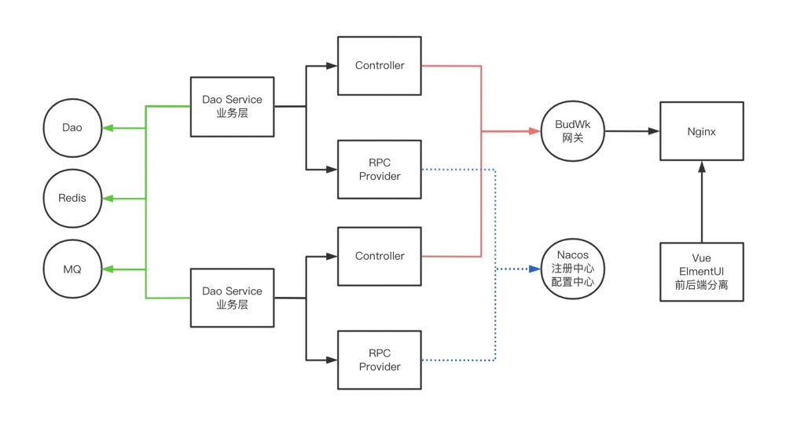

# 项目介绍
[](https://github.com/budwk/budwk/blob/master/LICENSE)
[](https://github.com/budwk/budwk/releases)
[](https://budwk.com/donation)


BudWk 原名 NutzWk ，是基于国产框架 nutzboot 开发的开源 Java企业级Web开发框架，拥有近十年的开源历史，积累了一大批企业和个人用户，历经V1-V8数次迭代。

V8 在 V7具备的API网关、组件库、认证中心、控制中心等功能基础上，进一步对前后端功能进行升级改造、提升用户体验，同时大大减轻开发工作量，提升开发效率，为产品升级迭代提供极大便利。

框架同时提供`微服务单应用`及`微服务分布式`版本供选择，后台集权限体系、系统参数、数据字典、站内消息、定时任务、CMS、微信等最常用功能，使其具有上手容易、开发便捷、扩展灵活等特性，特别适合各类大中小型定制化项目需求。

* **历史悠久**：开源近十年时间从V1-V8数次迭代，紧跟技术发展和企业应用需求，支持电子政务、电子商务、物联网、车联网等各类应用场景。
* **开源免费**：V8前后端所有代码完全开源免费，当然也期望获得捐赠，您的捐赠是框架持续发展的动力（注：接受付费的定制开发和企业开发培训）。
* **极易上手**：虽然V4、V6走过弯路，但作者始终坚持“在力所能及的情况下，最大限度的提高Web开发人员的生产力”，V8框架的架构简单、功能完善、学习成本低、自学或简单培训即可上手。
* **版本丰富**：V8后端提供单应用和分布式版本以供选择，两个版本功能完全一致，都支持war包部署和jar包部署，分布式版本基于 Nacos、Dubbo；V8前端提供 Vue2 + ElmentUI 和 Vue3 + Elemnt-Plus + TypeScript 两个版本以供选择。

## 前言
本文档将引导您一步步使用本框架搭建一个后台管理系统，并在此基础上做二次开发。

BudWk Java后端是基于 NutzBoot 开发的微服务分布式框架，NutzBoot 是在 Nutz 基础上的 boot 化封装，所以在开始之前，**请确保已详细阅读并掌握 Nutz 基础知识**:stuck_out_tongue:

* [http://nutzam.com/core/nutz_preface.html](http://nutzam.com/core/nutz_preface.html)

## 演示地址

* `管理后台` [https://demo.budwk.com](https://demo.budwk.com)
* `控制中心[接口文档]` [https://demo.budwk.com/api/platform/openapi/](https://demo.budwk.com/api/platform/openapi/#/load/openapi.json)
* `Ucenter[接口文档]` [https://demo.budwk.com/api/ucenter/openapi/](https://demo.budwk.com/api/ucenter/openapi/#/load/openapi.json)

## 技术架构

BudWk-V8/V7 采用目前流行的网关 + API + 前后端分离的架构，后端人员只需开发API，前端人员只需根据API文档开发页面效果，如果您的项目团队人员 `Java > 1 and Vue > 1` 那么开发效率会有较大提升，如果是一个人全栈，会比较辛苦……



## 技术选型

### 后端技术
技术 | 名称 | 官网
----|------|----
Nutz | JavaEE应用框架  | [https://nutzam.com](https://nutzam.com)
NutzBoot | 微服务框架  | [https://github.com/nutzam/nutzboot](https://github.com/nutzam/nutzboot)
SaToken | 权限框架  | [https://sa-token.dev33.cn](http://sa-token.dev33.cn)
Druid | 数据库连接池  | [https://github.com/alibaba/druid](https://github.com/alibaba/druid)
Nacos | 配置及注册中心  | [https://nacos.io](https://nacos.io)
Dubbo | 分布式服务框架  | [https://dubbo.apache.org](https://dubbo.apache.org)
Redis | 分布式缓存数据库  | [https://redis.io](https://redis.io)
Quartz | 作业调度框架  | [https://www.quartz-scheduler.org](https://www.quartz-scheduler.org)
IdGenerator | 雪花主键生成  | [https://github.com/yitter/IdGenerator](https://github.com/yitter/IdGenerator)
Hutool | 工具集合  | [https://hutool.cn](https://hutool.cn)

### Vue3前端技术 (wk-vue3-admin)
技术 | 名称 | 官网
----|------|----
Vue3 | MVVM框架 | [https://vuejs.org](https://vuejs.org)
Vite | 应用框架 | [https://vitejs.dev](https://vitejs.dev)
Element-Plus | 基于Vue3的UI框架 | [https://element-plus.gitee.io/zh-CN](https://element-plus.gitee.io/zh-CN/)
Font-awesome | 字体图标  | [https://fontawesome.com](https://fontawesome.com)

### Vue2前端技术 (wk-vue-admin)
技术 | 名称 | 官网
----|------|----
Vue.js | MVVM框架 | [https://vuejs.org](https://vuejs.org)
Nuxt.js | Vue通用应用框架 | [https://nuxtjs.org](https://nuxtjs.org)
ElementUI | 基于Vue的UI框架 | [https://element.eleme.io](https://element.eleme.io)
Font-awesome | 字体图标  | [https://fontawesome.com](https://fontawesome.com)

## 目录结构

```lua
budwk                               -- 根目录
│  ├─wk-starter                     -- 组件中心
│  │  ├─wk-starter-common           -- 通用类组件
│  │  ├─wk-starter-apiauth          -- API签名验证组件
│  │  ├─wk-starter-database         -- 数据库组件
│  │  ├─wk-starter-config           -- 配置组件
│  │  ├─wk-starter-dependencies     -- Jar依赖及版本号
│  │  ├─wk-starter-dubbo            -- Dubbo组件
│  │  ├─wk-starter-email            -- Email组件
│  │  ├─wk-starter-excel            -- Excel导入导出组件
│  │  ├─wk-starter-gateway          -- 网关组件
│  │  ├─wk-starter-job              -- 简易定时任务组件
│  │  ├─wk-starter-log              -- 日志及SLog组件
│  │  ├─wk-starter-openapi          -- 接口文档生成组件
│  │  ├─wk-starter-security         -- 权限验证组件
│  │  ├─wk-starter-sms              -- 短信发送组件
│  │  ├─wk-starter-storage          -- 文件存储组件
│  │  ├─wk-starter-web              -- WEB拦截跨越表单验证组件
│  ├─wk-gateway                     -- 网关中心
│  │  ├─websocket                   -- WebScoket支持
│  ├─wk-platform                    -- 控制中心
│  │  ├─wk-platform-common          -- 通用类供其他模块调用
│  │  ├─wk-platform-server          -- 服务类提供API及RPC服务
│  ├─wk-ucenter                     -- 认证中心
│  ├─wk-cms                         -- CMS管理
│  │  ├─wk-cms-common               -- 通用类供其他模块调用
│  │  ├─wk-cms-server               -- 服务类提供API及RPC服务
│  ├─wk-wechat                      -- 微信管理
│  │  ├─wk-wechat-common            -- 通用类供其他模块调用
│  │  ├─wk-wechat-server            -- 服务类提供API及RPC服务
│  ├─wk-vue-admin                   -- Vue2前端代码
│  ├─wk-vue3-admin                   -- Vue3前端代码
│  ├─wk-mini                        -- Mini单应用版本(一个jar启动无需nacos)
```

## 后台功能

### 控制中心

- 系统管理
  - 单位管理 `单位数据的增删改查、排序`  
  - 职务管理 `职务数据的增删改查、排序`
  - 用户管理 `用户数据的增删改查、重置密码、启用/停用、用户数据导出`
  - 角色管理 `角色组及角色管理、为角色分配菜单及权限、维护用户与角色关联关系`
  - 应用管理 `微服务模块应用的增删改查、启用/停用`
  - 菜单管理 `应用菜单的增删改查、权限的维护、菜单排序等`
  - 日志管理 `登录日志、业务日志的查询功能`
  - 任务管理 `定时任务的增删改查、启用/停用`
  - 消息管理 `站内消息的发送(含由程序触发的消息)、历史消息的查看`
- 系统配置
  - 系统参数 `公共参数、各应用参数的配置管理`
  - 数据字典 `公共数据字典、各应用数据字典的管理`
  - 密钥管理 `为API预留的密钥管理(API Sign -> API Token -> USER Token)`
  - 账户安全 `密码规则、密码重试次数、密码是否过期等配置、验证码设置`
- 运维管理
  - 服务列表 `查看在Nacos上注册的Dubbo服务或网关服务状态`
  - 服务器监控 `查看服务器CPU/内存/网络/Redis/Jvm等占用情况(当前仅支持单机部署)`

### UCenter

- 用户登录
  - 通过用户名 + 密码登录
  - 通过手机号 + 短信验证码登录
  - SSO单点登录
  - RSA前端密码加密
  - 第三方QQ、微信、支付宝登录
- 用户注册
  - 通过手机号 + 短信验证码注册
- 找回密码
  - 通过手机号 + 短信验证码找回
  - 通过Email + 验证码找回  
    
### CMS

- 站点管理 `多站点的基本信息管理`
- 栏目管理 `站点下栏目管理`
- 文章管理 `站点栏目下文章增删改查`
- 友情链接
  - 链接管理 
  - Banner管理
    
### WeChat

- 微信会员 `会员资料查看、首次需手动同步会员资料`
- 消息管理
  - 会员消息 `查看会员发送的纯文本、图片、视频等消息内容，并可进行回复`
  - 群发消息 `编辑图文素材、对选定范围会员进行消息群发`
- 自动回复
  - 文本内容 `管理纯文本内容`
  - 图片内容 `管理图片内容`
  - 图文内容 `管理图文内容`
  - 事件配置 `关注事件-用户关注公众号触发发送纯文本、图片、图文，关键词事件-用户发送信息内容包含关键词触发或公众号菜单绑定的关键词触发`
- 模版消息
  - 模版编号 `从微信公众号后台找到模版编号进行添加`
  - 模版列表 `通过模版编号同步模版内容`
  - 发送记录 `通过程序发送模版消息后查看发送记录`
- 微信配置
  - 公众号配置 `微信公众号配置、微信后台配置URL后平台可获取用户信息`
  - 菜单配置 `微信公众号菜单配置、推送菜单至微信`
  - 小程序配置 `微信小程序信息配置`
  - 微信支付 `微信支付商户信息配置、V2支付示例、V3支付示例`

## 问题反馈

* `问答社区` [https://nutz.cn](https://nutz.cn)
* `Gitee` [https://gitee.com/budwk/budwk/issues](https://gitee.com/budwk/budwk/issues)
* `Github` [https://github.com/budwk/budwk/issues](https://github.com/budwk/budwk/issues)
* `QQ1群` 68428921(已满)
* `QQ2群` 24457628
* `Q号/微信` wizzer **定制开发、企业培训**👌

