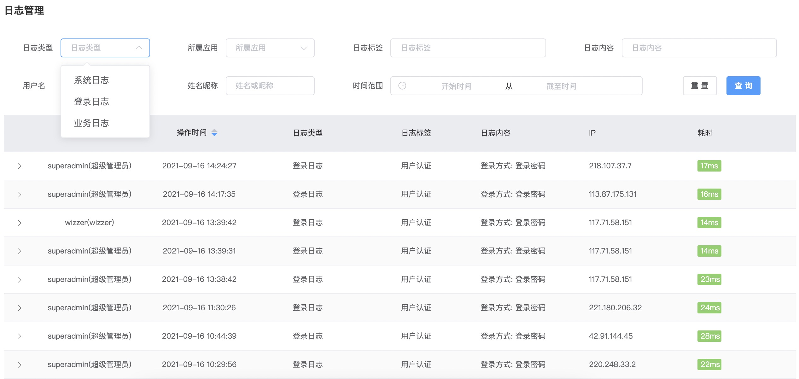

# 日志体系

## 日志生成

* 微服务模块如 `wk-platform-server` 引入 `wk-starter-log` 组件并进行配置

* 在控制类上使用注解 `@SLog(tag = "数据字典")` 定义日志标签

* 在控制类方法上使用注解 `@SLog(value = "")` 定义日志内容

```java
@IocBean
@At("/sys/dict")
@SLog(tag = "数据字典")
@ApiDefinition(tag = "数据字典")
@Slf4j
public class SysDictController {

      @At
      @Ok("json")
      @POST
      @SaCheckPermission("sys.config.dict.update")
      // value 可以使用表达式获取传参数
      @SLog(value = "修改字典项:${dict.name}")
      public Result<?> update(@Param("..") Sys_dict dict, HttpServletRequest req) {
          dict.setUpdatedBy(SecurityUtil.getUserId());
          sysDictService.updateIgnoreNull(dict);
          sysDictService.cacheClear();
          return Result.success();
      }
}
```

* 如需记录执行结果，可以通过表达式设置或使用内置 `_slog_msg` 属性名设置

```java
    // 方式1
    @At("/disabled")
    @Ok("json")
    @POST
    @SaCheckPermission("sys.config.dict.update")
    @SLog(value = "启用禁用:${id}-")
    public Result<?> changeDisabled(@Param("id") String id, @Param("disabled") boolean disabled, HttpServletRequest req) {
        int res = sysDictService.update(Chain.make("disabled", disabled), Cnd.where("id", "=", id));
        if (res > 0) {
            if (disabled) {
                // _slog_msg 为内置属性名，会自动拼接到 value
                req.setAttribute("_slog_msg", "禁用");
            } else {
                req.setAttribute("_slog_msg", "启用");
            }
            return Result.success();
        }
        return Result.error();
    }

    // 方式2
    @At("/disabled")
    @Ok("json")
    @POST
    @SaCheckPermission("sys.config.dict.update")
    @SLog(value = "启用禁用:${id}-${req.getAttribute('_result')}")
    public Result<?> changeDisabled(@Param("id") String id, @Param("disabled") boolean disabled, HttpServletRequest req) {
        int res = sysDictService.update(Chain.make("disabled", disabled), Cnd.where("id", "=", id));
        if (res > 0) {
            if (disabled) {
                req.setAttribute("_result", "禁用");
            } else {
                req.setAttribute("_result", "启用");
            }
            return Result.success();
        }
        return Result.error();
    }
```

## 日志查询

* 系统默认三种日志类型 `LogType` 枚举，您可以根据业务需要扩展

* 系统默认数据库存储方式（可选 MongoDB），数据库存储方式已自动按月分表，并且支持跨月查询



## 链路追踪

* 商业版具有日志链路追踪功能，即程序运行日志中，可对请求来源、响应、Dubbo调用链进行记录和追踪，在分布式体系中便于分析问题

* 使用ELK，聚合日志通过 traceId 查询整条链路日志


