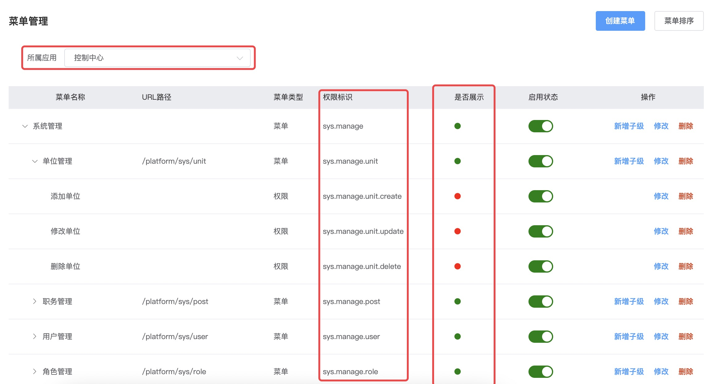

# 权限体系

* 本系统采用典型的 `RBAC0模型`，即 `用户-角色-权限(菜单权限+按钮权限)` 实现权限控制

## 应用管理

* `API网关` 将通过应用的 `请求路径` 进行路由代理，您可以根据业务特点将系统划分为不同的应用，并对应用分别配置菜单和权限

* `系统公用[COMMON]` 为系统公共内容，如配置公共的系统参数、各应用共有的菜单如站内消息、修改个人资料、修改个人密码等

* `控制中心[PLTAFORM]` 为系统基础应用，提供用户权限体系的业务实现、基础业务表的管理功能等

* `用户中心[UCENTER]` 为内置应用无需创建，主要提供用户登录、验证码、第三方登录等功能


## 菜单管理

* 一级菜单为功能分类，二级菜单为具体功能需配置URL请求路径，三级菜单为页面内部跳转路径(如果能用弹出框实现交互就尽量不用跳转)

* `是否展示` 属性决定配置的菜单，是否在前端导航栏展示

* 菜单需设置全局唯一的`权限标识`，菜单子权限同样需要设置`权限标识`，在框架中`角色`所拥有的权限是`权限标识`的集合




## 单位管理

* 顶级单位为 `总公司(或公司)`，`总公司`下可以创建`分公司`或`部门`，`分公司`仅可以创建`部门`

* 在业务开发的时，业务表可同时存储 `unitId` 和 `unitPath` 两个字段，`unitPath`即为树形单位表的`path`字段，最大100长度，4位一级的如 `00010001`的字符串，
  可通过`like`查询语句快速查询上下级关系数据


## 用户管理

* `用户`必须归属某个`单位`，新建用户需在左侧先选定单位


* 手机号码与用户名一致现在比较普及，系统默认以手机号码后六位做登录密码

* V7商业版中可通过`账户安全设置` 设置用户登录时是否需强制修改默认密码

* 可将多个角色分配给用户，如系统公共角色、公司或分公司所属角色


## 角色管理

* 左侧选择`总公司或公司`，选定`角色`，右侧可以查看`用户列表`、各应用`菜单和权限`

* `系统公用组`-`公共角色` 是系统内置角色，此角色所分配的`菜单和权限`默认所有用户都拥有


* 在`总公司或公司` 单位下可以创建`角色组`和`角色`，并设置全局唯一的`角色代码`


* `关联用户到角色` 将`用户`与`角色`建立绑定关系，`用户`与`角色`是多对多的关系


* TAB切换到应用下，为`角色`分别分配`菜单和权限`


## 登录过程

* 用户在登录页输入用户名及密码后，`wk-ucenter` 会先进行验证码校验，校验通过后RPC调用 `wk-platform` 接口判断用户名及密码是否正确

* 用户名及密码验证正确，`wk-platform` 则返回`角色代码`和`权限标识`集合数据，由`wk-ucenter`中的`sa-token` 缓存`角色代码`和`权限标识`并生成 `token`
  
* `wk-ucenter` 将 `用户信息`、`菜单和权限`、`token`等信息返回给前端

## 权限控制

* 后端主要通过 `sa-token` 提供的注解`SaCheckPermission 权限标识`、`SaCheckRole 角色代码`、`SaCheckLogin 是否登录` 在控制层实现权限拦截
  
* 除了注解， 您也可以通过 `StpUtil.checkPermission("") 等` 工具类方法在代码中判断权限

* 额外提一嘴，为什么选择`sa-token`而舍弃`shiro`呢，因为苦`shiro`久已，懂得的都懂……

```java
    @At
    @Ok("json")
    @GET
    @SaCheckPermission("sys.manage.menu")
    public Result<?> data() {
        NutMap map = NutMap.NEW();
        map.addv("apps", sysAppService.listAll());
        return Result.data(map);
    }
```

* 前端主要通过封装的 `v-permission` 判断权限，控制页面组件是否显示

```vue
<el-button
          v-permission="'sys.manage.menu.create'"
          size="small"
          type="primary"
          @click="openAdd"
        >
        创建菜单
</el-button>
```