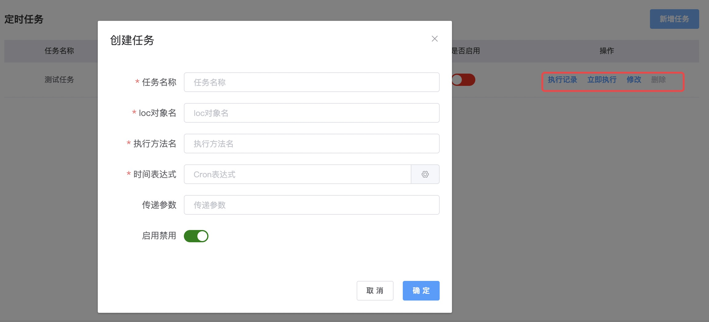

# 定时任务

* V7/V8 内置了一套简易的分布式定时任务实现机制，通过引入 `wk-starter-job` 组件，在方法上使用 `@SJob` 注解定义任务


```java
@IocBean(name = "testJob",singleton = false)
@Slf4j
public class TestJob {

    @SJob("demo")
    public void demo(String taskId, String params) {
        log.info("sjob:{} taskId:{} params:{}", "demo", taskId, params);
    }
}
```

* 通过控制中心`定时任务`管理，设置定时任务执行时间周期

