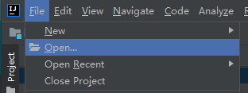
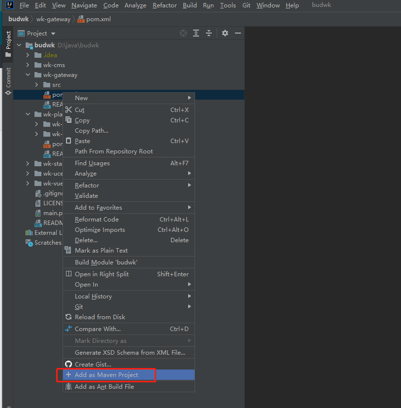

# 项目设置

## IDEA 打开项目

* 使用 `IDEA -> File -> Open` 打开项目根目录，如 `D://java/budwk`



* 分别展开 `wk-gateway / wk-platform / wk-ucenter / wk-cms` 
  
* 在 `pom.xml` 文件上鼠标右击，选择 `Add as Maven Project` 

* 耐心等待，IDEA 会自动通过 Maven 下载依赖Jar包，并构建项目结构（IDEA 右下角可以查看进度）



## 项目配置文件

* 如果您的 Nacos 与 MariaDB 不是在本机运行，请通过 IDEA 搜索 `127.0.0.1`，修改 `application.yaml` 为实际的IP地址和端口号

* 数据库相关地址配置

```yaml
jdbc:
  url: jdbc:mysql://127.0.0.1:3306/budwk_v7?useUnicode=true&characterEncoding=utf8&useSSL=false
  username: root
  password: root
```
* Nacos 服务发现、配置中心、Dubbo服务注册相关地址配置


```yaml
nacos:
  discovery:
    server-addr: 127.0.0.1:8848
    namespace: dev
    naming:
      service-name: budwk.wechat
      meta-data: "{'version':'v1'}"
  config:
    server-addr: 127.0.0.1:8848
    namespace: dev
    data-id: wk-wechat
    data-type: yaml
dubbo:
  registry:
    address: nacos://127.0.0.1:8848?namespace=dev
  protocol:
    name: dubbo
    threads: 200
    #随机端口
    port: 0
    #默认关闭QOS服务
  application:
    qos:
      enable: false
```
