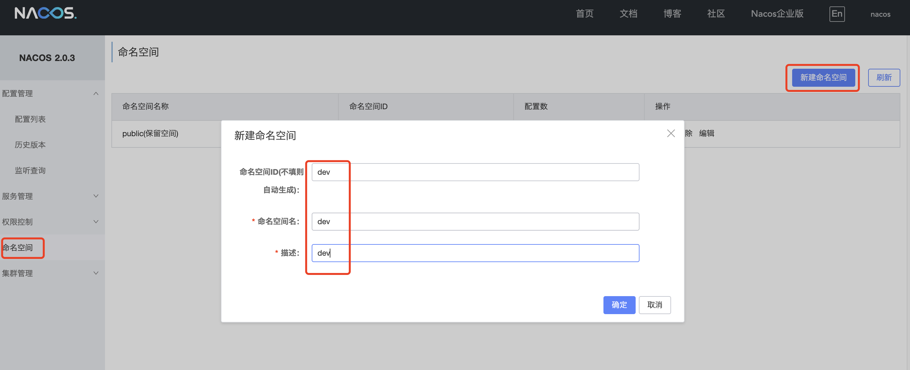
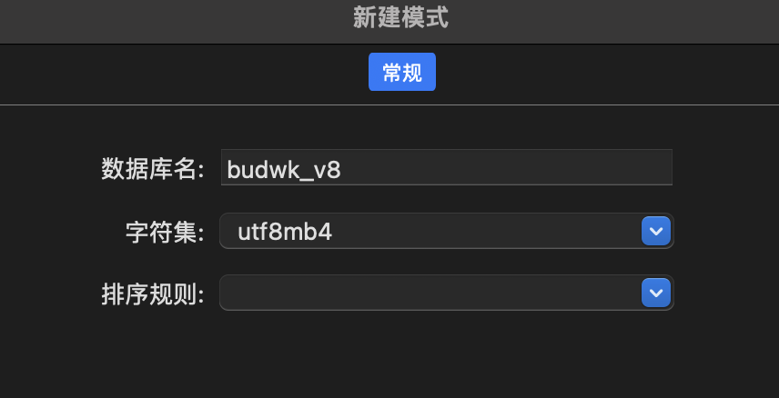

# 初始化设置

## Nacos 设置

* 见环境搭建 Nacos 章节，启动 Nacos

* 浏览器访问 [http://127.0.0.1:8848/nacos](http://127.0.0.1:8848/nacos) 输入用户名 `nacos` 密码 `nacos` 登录

* 新建命名空间 `dev` 
  
* 注意：命名空间ID、命名空间名称，都必须是 `dev`

## MariaDB 设置

* 见环境搭建 MariaDB 章节，连接数据库

* 创建名为 `budwk_v8` 的空数据库
  
* 注意：项目启动时会自动创建表结构和初始化数据，不用手动导入sql

