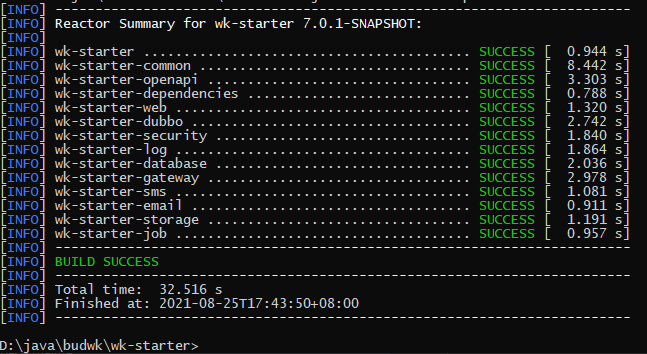
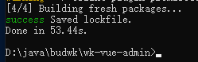

# 依赖安装

## Maven 依赖安装

* 打开命令行，切换到 `wk-starter` 目录下执行 `mvn install` 命令

* 如果您的 Maven 不能正常下载，可执行 `mvn install -U` 命令

```text
D:\>cd java

D:\java>cd budwk

D:\java\budwk>cd wk-starter

D:\java\budwk\wk-starter>mvn install
```
* 切换到 `wk-platform` 目录下执行 `mvn install` 命令

```text
D:\java\budwk\wk-platform>mvn install
```



## Node 依赖安装

* 打开命令行，切换到 `wk-vue3-admin` 目录下执行 `npm i` 或 `pnpm i` 命令

```text
D:\java\budwk>cd wk-vue3-admin

D:\java\budwk\wk-vue3-admin>pnpm i
```

