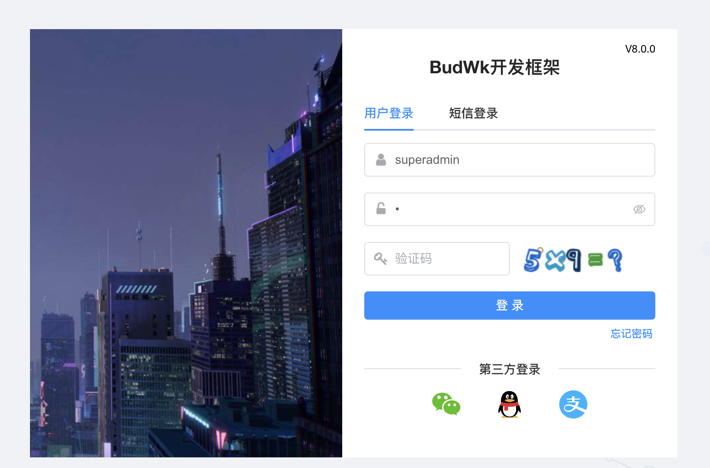

# 项目启动

## Java 后端启动

* 启动顺序 `wk-platform` -> `wk-ucenter` -> `wk-gateway` -> `其他模块`

* 分别找到微服务模块下的 `***Launcher` 类，右击 -> Run


  
* 启动完成后，浏览器访问 [http://127.0.0.1:9900](http://127.0.0.1:9900) 显示404错误是正确的


## Vue 前端启动


* 打开命令行，切换到 `wk-vue-admin` 目录下执行 `npm run dev` 或 `yarn run dev` 命令

```text
D:\java\budwk\wk-vue-admin>yarn run dev
```


* 启动完成后，浏览器访问 [http://127.0.0.1:8800](http://127.0.0.1:8800) 即可登录管理后台


